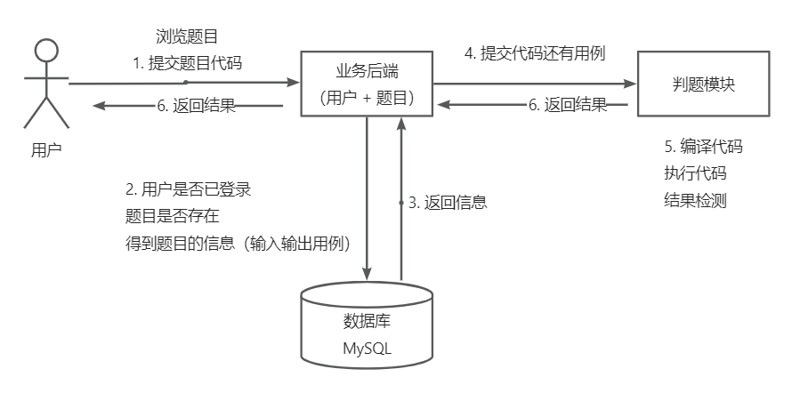
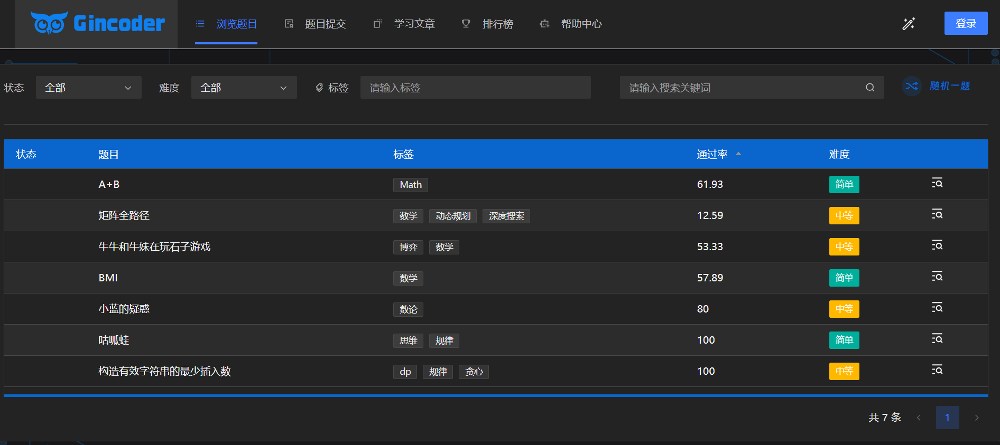
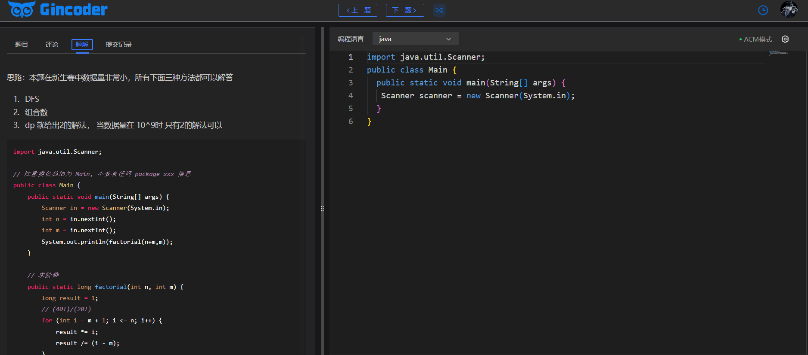
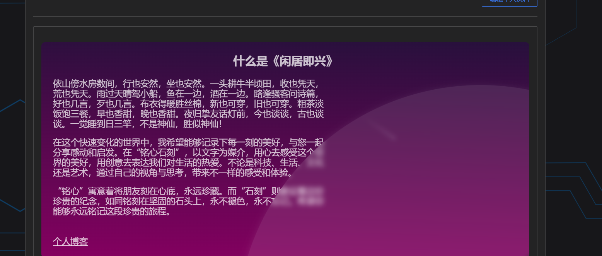

在线体验地址： https://www.gincode.icu

## 项目介绍:smiley_cat:

在系统前台，管理员可以创建、管理题目；用户可以自由搜索题目、阅读题目、编写并提交代码。还提供了排行榜以及技术文章来增加网站丰富度，提供了评论系统供大家在做题时讨论。
在系统后端，能够根据管理员设定的题目测试用例在代码沙箱中对代码进行编译、运行、判断输出是否正确。
其中，代码沙箱可以作为独立服务，提供给其他开发者使用。

业务流程：

## 前技术选项:sweat_drops: 

- Vue3
- Vue-CLI脚手架
- VueX状态管理
- Arco Design组件库
- 手写前端项目模板（通用布局、权限管理、状态管理、菜单生成
- Monaco Editor代码编辑器
- :boom:OpenAPI前端代码生成

## 项目前端特点:sparkles:

- 做题UI仿LeetCode页面，拖拽式。
- 提供明、暗两种主题风格。
- 动态路由区分不同用户。
- 接入第三方登录，减少注册成本。
- 文件存储在第三方加快响应速度。
- 发布评论、回复评论、表情包。
- 文章以及题目题解都是采用 Markdown 编辑器。
- 文章以及排行榜在未登陆情况下可以游玩。

## 部分运行截图:japanese_ogre: 

